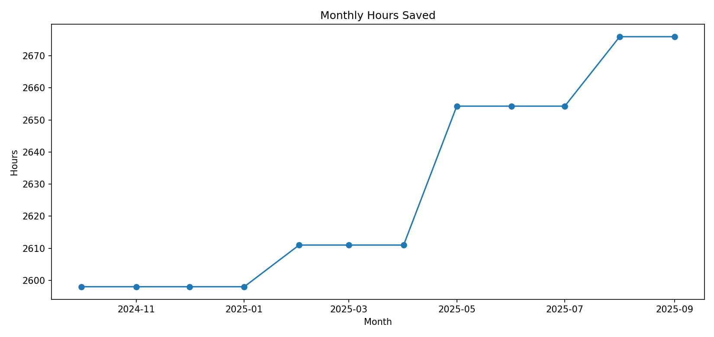
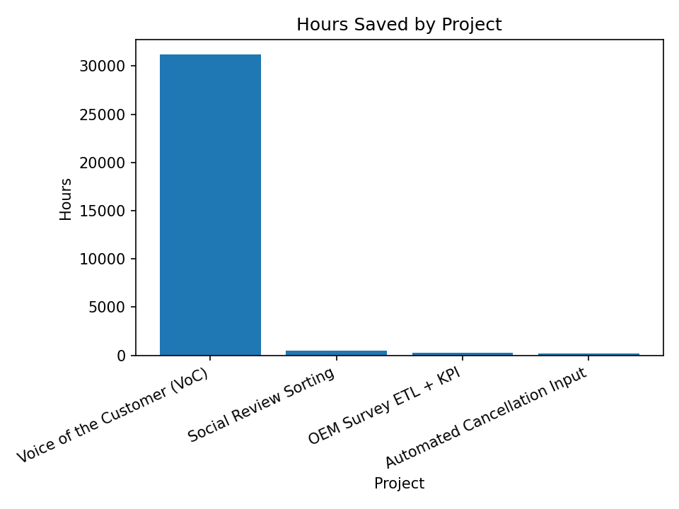
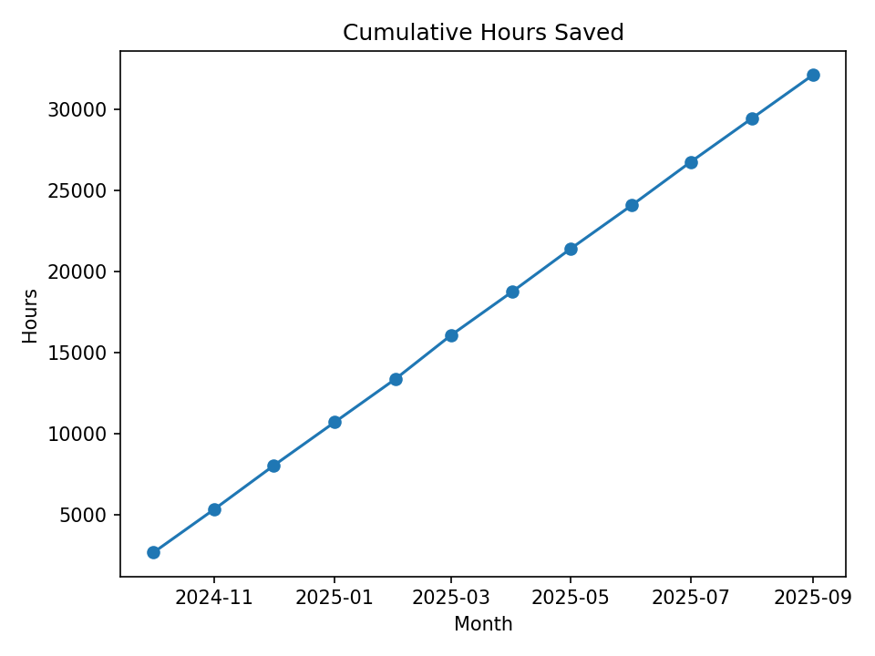

 
<link rel="stylesheet" href="assets/css/custom.css">

<h1>Automation Impact</h1>
Hours and cost saved from deployed automations
<a class="btn" href="https://github.com/ejr1216/portfolio">View on GitHub</a>

## KPI Summary

| KPI | Value |
| --- | ---: |
| Total Hours Saved | 32111.3 |
| Estimated Cost Saved | $706,448 |
| FTE Saved (est.) | 15.44 |
| Avg Monthly Hours | 2675.9 |

## Charts

## Top Projects by Hours

| Project | Hours | Cost |
| --- | ---: | ---: |
| Voice of the Customer (VoC) | 31176.0 | $685,872 |
| Social Review Sorting | 519.6 | $11,431 |
| OEM Survey ETL + KPI | 259.8 | $5,716 |
| Automated Cancellation Input | 155.9 | $3,429 |

## Monthly Summary

| Month | Hours | Cost |
| --- | ---: | ---: |
| 2024-10 | 2675.9 | $58,871 |
| 2024-11 | 2675.9 | $58,871 |
| 2024-12 | 2675.9 | $58,871 |
| 2025-01 | 2675.9 | $58,871 |
| 2025-02 | 2675.9 | $58,871 |
| 2025-03 | 2675.9 | $58,871 |
| 2025-04 | 2675.9 | $58,871 |
| 2025-05 | 2675.9 | $58,871 |
| 2025-06 | 2675.9 | $58,871 |
| 2025-07 | 2675.9 | $58,871 |
| 2025-08 | 2675.9 | $58,871 |
| 2025-09 | 2675.9 | $58,871 |