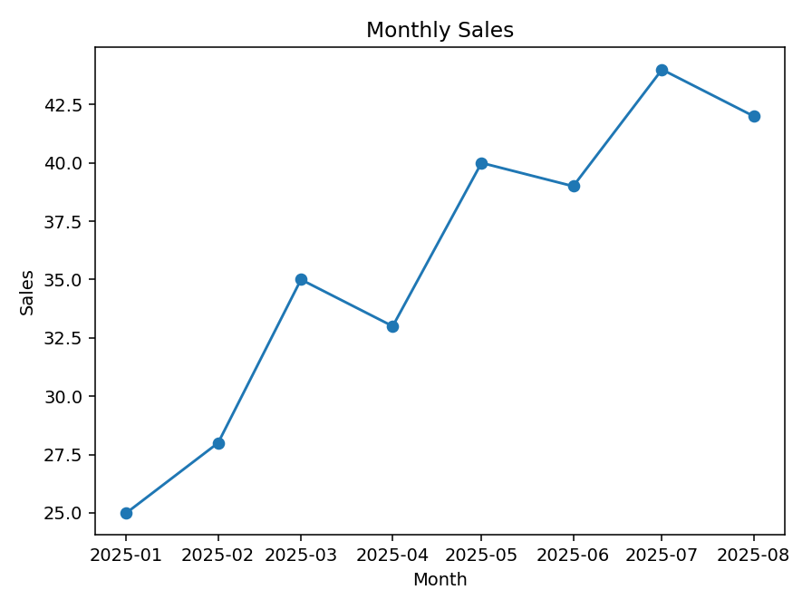
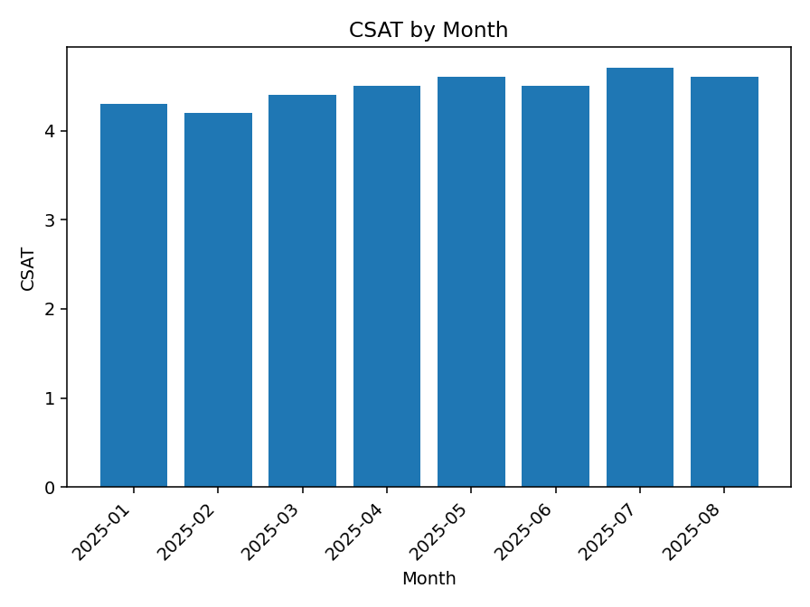
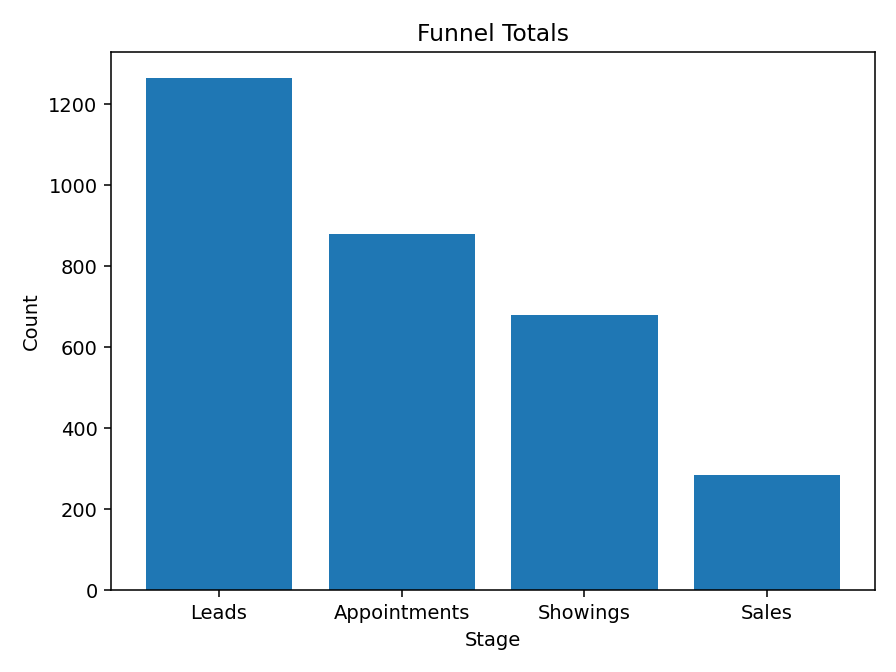
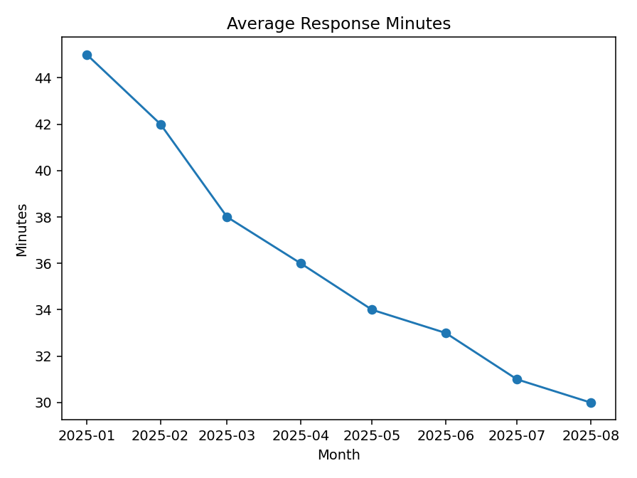

# Portfolio KPIs

| KPI | Value |
| --- | ---: |
| Total Sales | 286 |
| Average CSAT | 4.47 |
| Conversion Rate | 22.61% |
| Avg Response Minutes | 36.1 |
| Total Leads | 1265 |
| Total Appointments | 879 |
| Total Showings | 680 |
| Total Revenue | $575,000 |

## Charts

## Monthly Summary

| Month | Leads | Appointments | Showings | Sales | Csat | Responseminutes | Revenue |
| --- | --- | --- | --- | --- | --- | --- | --- |
| 2025-01 | 120 | 80 | 60 | 25 | 4.30 | 45.0 | $50,000 |
| 2025-02 | 140 | 90 | 70 | 28 | 4.20 | 42.0 | $56,000 |
| 2025-03 | 160 | 110 | 85 | 35 | 4.40 | 38.0 | $70,000 |
| 2025-04 | 155 | 105 | 80 | 33 | 4.50 | 36.0 | $66,000 |
| 2025-05 | 170 | 120 | 95 | 40 | 4.60 | 34.0 | $82,000 |
| 2025-06 | 165 | 118 | 92 | 39 | 4.50 | 33.0 | $79,000 |
| 2025-07 | 180 | 130 | 100 | 44 | 4.70 | 31.0 | $88,000 |
| 2025-08 | 175 | 126 | 98 | 42 | 4.60 | 30.0 | $84,000 |